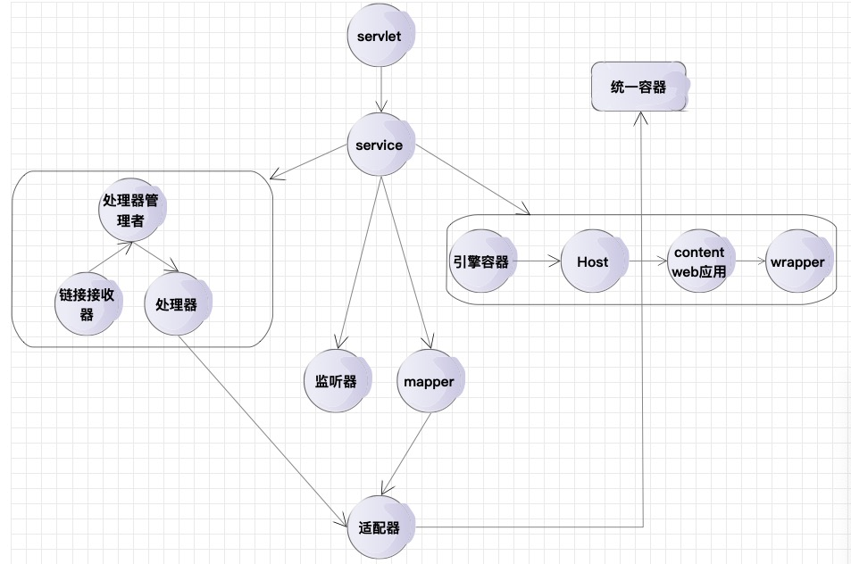

# Tomcat底层源码解析

- tomcat8.5 支持兼容 tomcat9和tomcat8 servlet版本选取3.1 `tomcat8 tomcat8.5`
- tomcat [apache 戴维斯 两者共同合作维护形成的] tomcat最低从3.0版本开始 tomcat8.5比tomcat9版本要后出
- JBOSS是内部兼容tomcat的,JBOSS在集群方面做得很好
- apache服务器、nginx服务器

------

| 服务器 | 与Tomcat的区别 |
| :---: | :--- |
| apache | apache是web服务器   tomcat是应用（java）服务器   tomcat是apache的扩展   apache不能解释java程序,tomcat可以 |
| nginx | nginx常用做静态内容服务和代理服务器,直接外来请求转发给后面的应用服务器   tomcat更多用来做一个应用的容器 |

------

- 适配器模式
- 责任链模式

------

- tomcat中所有的组件都有生命周期 lifeCye
- tomcat中所有的组件可以共用线程池,如果是组件内部定义的线程池的话都不可共用

**手动启动tomcat源码报错的问题**

>原因是我们直接启动org.apache.catalina.startup.Bootstrap的时候没有加载org.apache.jasper.servlet.JasperInitializer,从而无法编译JSP
>这在Tomcat6/7是没有这个问题的
>解决办法是在tomcat的源码org.apache.catalina.startup.ContextConfig中手动将JSP解析器初始化